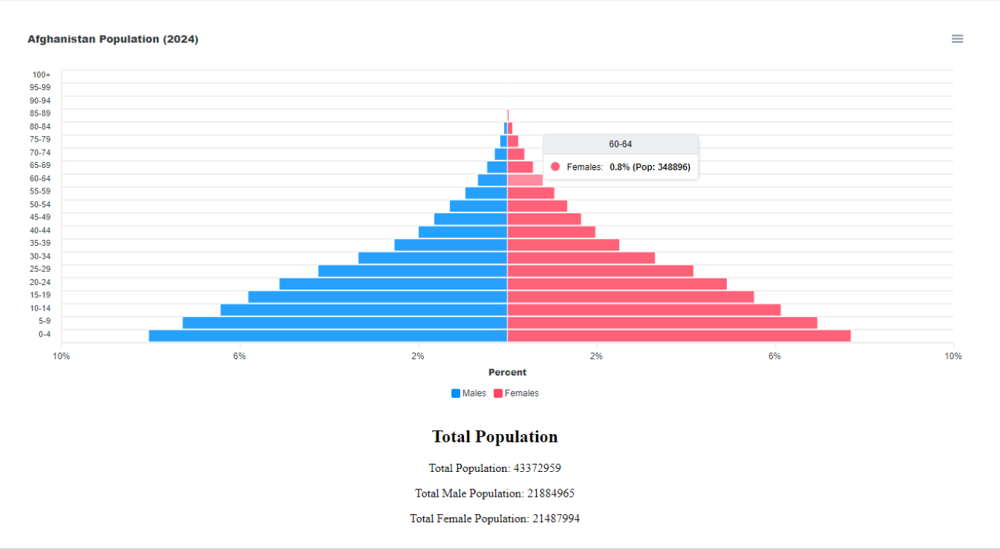

> # Population Funnel Chart

<div align="center">

| Project Image |
| ----------------------------------------------------------------------------------------------------------------------- |
|  |

</div>

# 📖 [Population Funnel Chart] <a name="about-project"></a>

**[Population-Funnel-Chart]** A React project that visualizes the population of Afghanistan retrieved from ([PopulationPyramid.net](https://www.populationpyramid.net/afghanistan/2024/)) across different age categories using a funnel chart implemented with React ApexCharts.

<br/>

### 🔆 Features

- Utilization of React ApexCharts for dynamic funnel chart creation.
- Displaying Afghanistan's 2024 population data visually.
- Detailed tooltips provide insightful data presentation.
- Visualization of population data by age category.

<br/>

### 🚀 Live Demo
 - [Live Demo on Vercel](https://populationfunnelchart.vercel.app/)

<br/>

### ⚙ Install

Install this project with:

```sh
  npm install
  npm run dev
```

<br/>

## 👥 Author <a name="authors"></a>

👤 **Abdul Ali Noori**

- GitHub: [@ab-noori](https://github.com/ab-noori)
- Twitter: [@AbdulAliNoori4](https://twitter.com/AbdulAliNoori4)
- LinkedIn: [abdulali-noori](https://www.linkedin.com/in/abdulali-noori)

  
## 🙏 Acknowledgments
I would like to express my gratitude to ([PopulationPyramid.net](https://www.populationpyramid.net/afghanistan/2024/)) for providing the population data used in this project,

## 📝 License <a name="license"></a>

This project is [MIT](./LICENSE) licensed.


